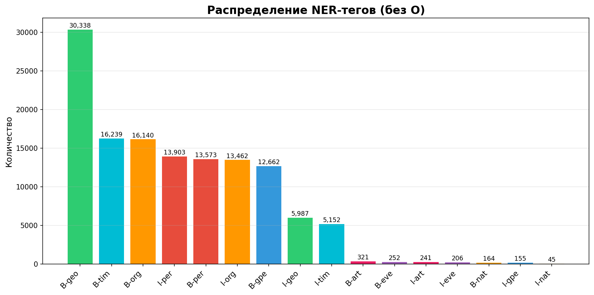
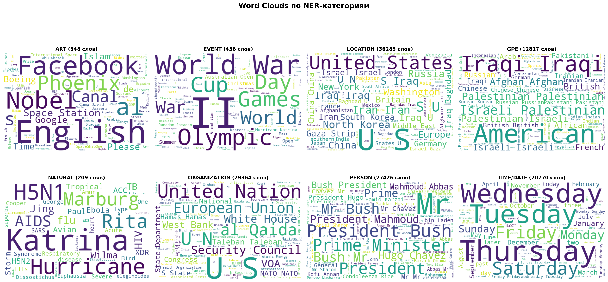
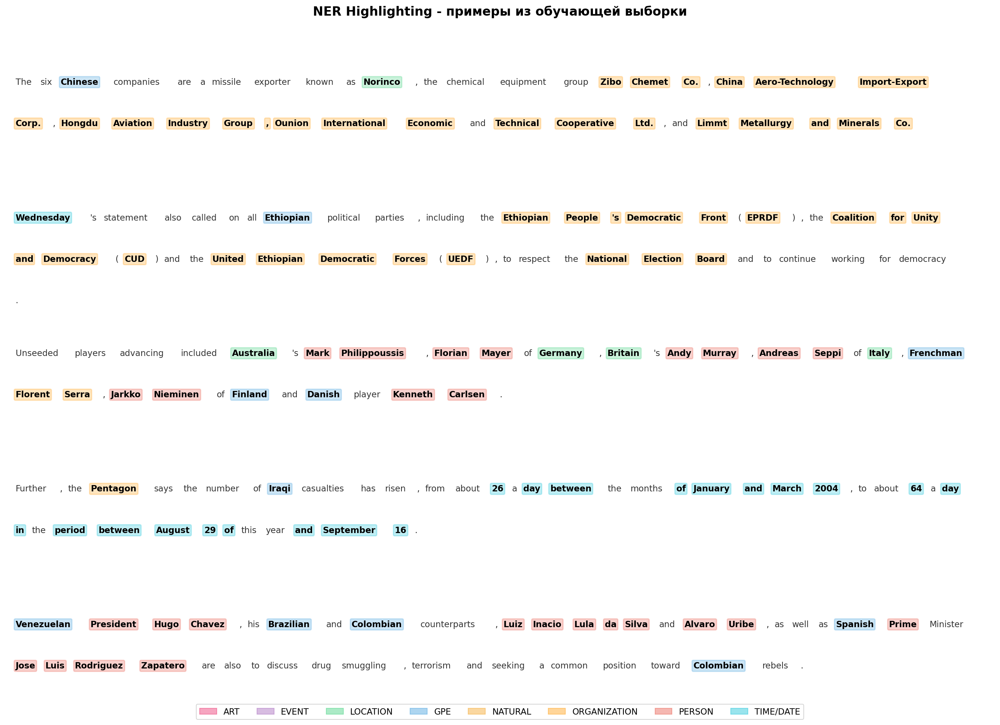

# Отчёт: Лабораторная 2 — NER

## 1. Описание задачи

Задача — построить систему распознавания именованных сущностей (NER) на новостном датасете в формате IOB2. Классы: O, B-/I- для per, gpe, eve, geo, nat, art, tim, org (17 классов). Требуемый порог: Macro F1 > 0.5.

## 2. Анализ данных

Обучающая выборка содержит 839 364 токена в 38 367 предложениях. Тестовая — 209 211 токенов.

### Распределение классов

| Тег | Количество | Доля |
|-----|--------:|------:|
| O | 710 524 | 84.65% |
| B-geo | 30 338 | 3.61% |
| B-tim | 16 239 | 1.93% |
| B-org | 16 140 | 1.92% |
| I-per | 13 903 | 1.66% |
| B-per | 13 573 | 1.62% |
| I-org | 13 462 | 1.60% |
| B-gpe | 12 662 | 1.51% |
| I-geo | 5 987 | 0.71% |
| I-tim | 5 152 | 0.61% |
| B-art | 321 | 0.04% |
| B-eve | 252 | 0.03% |
| I-art | 241 | 0.03% |
| I-eve | 206 | 0.02% |
| B-nat | 164 | 0.02% |
| I-gpe | 155 | 0.02% |
| I-nat | 45 | 0.01% |

**Вывод:** данные сильно несбалансированы. Класс O составляет 84.65%. Категории eve, nat, art — менее 0.05% каждая, что затрудняет обучение на этих классах.



## 3. NER-модель

### Выбор подхода

Выбран **CRF (Conditional Random Field)** — классический метод для задач sequence labeling:
- Учитывает зависимости между соседними токенами (переходы B- -> I-)
- Работает с произвольным набором признаков
- Подходит для задач с IOB2-разметкой

Библиотека: sklearn-crfsuite.

### Признаки

Для каждого токена извлечены следующие признаки:

| Группа | Признаки |
|--------|----------|
| Слово | lower, суффиксы (-2, -3), префиксы (2, 3), длина |
| Регистр | isupper, istitle, isdigit, isalpha |
| Символы | наличие дефиса, точки |
| POS | часть речи из датасета |
| Контекст -1 | lower, title, upper, POS предыдущего слова |
| Контекст +1 | lower, title, upper, POS следующего слова |
| Контекст -2 | lower, title, POS через одно слово назад |
| Контекст +2 | lower, title, POS через одно слово вперёд |
| Позиция | BOS (начало), EOS (конец предложения) |

Итого ~20 признаков на токен. Контекстное окно +-2 позволяет модели учитывать окружение слова.

### Гиперпараметры CRF

| Параметр | Значение |
|----------|----------|
| algorithm | L-BFGS |
| c1 (L1) | 0.1 |
| c2 (L2) | 0.1 |
| max_iterations | 100 |
| all_possible_transitions | True |

Время обучения: ~230 секунд.

### Результаты

```
              precision    recall  f1-score   support

       B-per     0.9734    0.9606    0.9670     13573
       I-per     0.9667    0.9779    0.9723     13903
       B-gpe     0.9890    0.9677    0.9782     12662
       I-gpe     0.9917    0.7742    0.8696       155
       B-eve     0.9502    0.9087    0.9290       252
       I-eve     0.9314    0.9223    0.9268       206
       B-geo     0.9489    0.9754    0.9620     30338
       I-geo     0.9536    0.9688    0.9611      5987
       B-nat     0.9640    0.8171    0.8845       164
       I-nat     0.9524    0.8889    0.9195        45
       B-art     1.0000    0.9221    0.9595       321
       I-art     1.0000    0.9295    0.9634       241
       B-tim     0.9840    0.9637    0.9738     16239
       I-tim     0.9734    0.9660    0.9697      5152
       B-org     0.9554    0.9201    0.9374     16140
       I-org     0.9740    0.9733    0.9736     13462

   macro avg     0.9693    0.9273    0.9467    128840
```

**Macro F1 = 0.9467** — порог 0.5 пройден.

**Анализ по категориям:**

- Лучшие: B-gpe (0.978), I-per (0.972), B-tim (0.974) — частые категории с хорошей precision и recall
- Худшие: I-gpe (0.870), B-nat (0.884) — очень малое количество примеров (155 и 164 соответственно)
- Precision в среднем выше recall (0.969 vs 0.927), т.е. модель консервативна: реже ошибочно присваивает NER-тег, но иногда пропускает сущности
- Для редких классов (art, eve, nat) модель показывает высокую precision (вплоть до 1.0), но recall ниже — не все примеры найдены

## 4. Система управления сущностями

Реализован класс `EntityManager` (entity_manager.py):

**add_entity / delete_entity** — ручное добавление и удаление сущностей с указанием категории. Хранение в JSON.

**parse_text** — NER на произвольном входном тексте. Используется обученная CRF-модель с эвристической POS-разметкой. Найденные сущности автоматически добавляются в хранилище.

**get_texts** — получение всех текстов, в которых упоминается заданная сущность.

Пример работы:

```
Текст: "President Barack Obama met with German Chancellor
        Angela Merkel in Berlin on Monday."
Найдено: [('President Barack Obama', 'per'),
          ('German', 'gpe'),
          ('Chancellor Angela Merkel', 'per'),
          ('Berlin', 'geo'),
          ('Monday', 'tim')]
```

Модель корректно определяет многословные сущности (President Barack Obama) и различает категории (per, gpe, geo, tim).

## 5. Визуализации

### Word Clouds по категориям



Статистика слов по категориям:

| Категория | Всего слов | Уникальных |
|-----------|--------:|----------:|
| LOCATION | 36 283 | 3 300 |
| ORGANIZATION | 29 364 | 4 509 |
| PERSON | 27 426 | 5 108 |
| TIME/DATE | 20 770 | 1 238 |
| GPE | 12 817 | 439 |
| ART | 548 | 401 |
| EVENT | 436 | 144 |
| NATURAL | 209 | 50 |

Word clouds показывают паттерны: в LOCATION доминируют названия стран и городов, в PERSON — имена политиков и общественных деятелей, в ORGANIZATION — аббревиатуры (U.N., EU) и названия компаний.

### Подсветка NER



Каждая категория имеет свой цвет, многословные сущности объединяются через B-/I- теги.

## 6. Submission

`output/my_submission.csv`: 209 211 строк. Распределение предсказаний на тесте пропорционально обучающей выборке:
- O: 177 764 (84.9%)
- B-geo: 7 725, B-tim: 3 914, B-org: 3 732 — доминирующие NER-классы

## 7. Выводы

1. CRF-модель с контекстными признаками (+-2 слова) достигает Macro F1 = 0.9467
2. Главный фактор качества — набор признаков: POS-теги, регистр, контекстное окно
3. Слабое место: редкие категории (nat, eve, art) — малое количество примеров снижает recall
4. EntityManager позволяет управлять сущностями и парсить произвольные тексты
